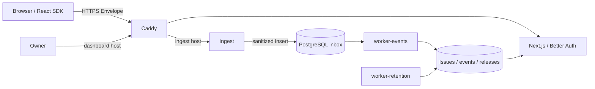

# GetException · первая итерация MVP

Рабочий путь: защищённый setup → Owner с TOTP → проект и публичный DSN → browser/React SPA → PostgreSQL inbox → worker → список групп и очищенный stack trace в кабинете. Сервер работает на собственной инфраструктуре; отдельный лендинг в этот репозиторий не входит.

## Ручной просмотр без повторного setup

```bash
yarn local:start
yarn local:stop
```

Кабинет: `https://monitor.localhost:8443`. Это постоянный локальный запуск: база, аккаунт, настройки MFA, проекты и адреса сохраняются в `runtime/local`. Setup и подключение аутентификатора нужны один раз. Перед первым запуском выполните `yarn checks`; требования и инструкции находятся в [local-preview.md](docs/local-preview.md).

Роли, команды, приглашения и MFA: [пошаговая ручная проверка](docs/manual-testing-members.md). Тестовая почта доступна в Mailpit: `http://127.0.0.1:8025`; реальные почтовые аккаунты не нужны. Перед первым запуском на другом компьютере выполните `yarn local:mailpit`. Здесь бинарник уже подготовлен.

## Выпуск и серверная установка

Push в `stable` запускает серверный Release: проверки, публикацию образов и проверку опубликованного установщика. Публикация SDK запускается отдельно вручную; для серверного релиза `NPM_TOKEN` не нужен. Автоматическое подключение к серверу включается отдельно после первой установки.

```bash
/opt/getexception/getexception update --release FULL_RELEASE_SHA
```

Команда обновляет приложения и сохраняет Owner, MFA, участников и события. Подробная [инструкция установки и обновления](docs/deployment.md).

## Локальный запуск через Docker

Нужны Node **24.20.0**, Corepack, Yarn **4.17.1** и установленный оператором Docker с Compose v2. Используется `node_modules`, PnP запрещён.

```bash
nvm use
corepack enable
yarn install --immutable
yarn ci:tools
yarn local:mailpit
yarn checks
yarn local:env
docker compose config --quiet
docker compose up --build -d
```

`yarn checks` также собирает fixtures: Caddy монтирует их `dist` с хоста. `yarn local:env` создаёт независимые случайные секреты в `.env` с правами `0600` и одноразовый setup token в `runtime/setup-token`. Скрипт отказывается перезаписывать существующий `.env`. Токен не выводится в терминал; прочитайте файл локально и удалите его после setup. В БД migrate сохраняет только SHA-256 токена с TTL 24 часа. Повторный запуск migrate после завершённого setup ничего не переоткрывает.

Локальные hosts должны разрешаться в `127.0.0.1`:

```text
127.0.0.1 monitor.localhost ingest.monitor.localhost browser.monitor.localhost react.monitor.localhost
```

Chrome поддерживает `*.localhost`; для другого окружения добавьте эту строку в hosts средствами ОС. Caddy выпускает локальные HTTPS-сертификаты. После старта скопируйте публичный корневой сертификат и добавьте его в локальное хранилище доверия браузера/ОС:

```bash
docker compose cp caddy:/data/caddy/pki/authorities/local/root.crt runtime/caddy-local-root.crt
```

Доверяйте только сертификату собственной тестовой установки. Эта Compose-конфигурация слушает **только loopback:443** и предназначена для разработки, а не production deploy.

1. Откройте `https://monitor.localhost/setup`, введите setup token.
2. Задайте email и пароль Owner. Домен должен совпадать с `DASHBOARD_HOST`: маршрутизацию и TLS оператор задаёт до setup.
3. Добавьте ручной ключ в TOTP-приложение и подтвердите первый код. Сохраните показанные один раз recovery codes.
4. Войдите на `/login` с **новым** TOTP-кодом: предыдущий уже использован. После пяти минут подтвердите пароль и новый код в **Settings → Confirm your identity** перед созданием проекта.
5. Создайте проект. В allowed origins добавьте `https://browser.monitor.localhost` и `https://react.monitor.localhost`, каждое с новой строки.
6. Сохраните показанный один раз DSN и вставьте его в форму **Connect** на соответствующем fixture host. Кнопки создают обычную ошибку, `window.error`, `unhandledrejection` и ошибку React ErrorBoundary.
7. Откройте Issues: worker создаст группы. Выберите ошибку, просмотрите события, stack trace и breadcrumbs. Resolve закрывает группу; новое событие снова откроет её как Regression.

DSN содержит публичный **write-only** ключ. Он не позволяет читать ошибки или войти в кабинет. В БД сохраняется только его SHA-256; UI повторно ключ не раскрывает. Потерянный DSN в этой итерации требует нового проекта: управление ротацией будет добавлено отдельно.

```bash
docker compose ps
docker compose logs --tail=30 web ingest worker-events
docker compose down
```

`down` сохраняет данные в volume. Не удаляйте PostgreSQL volume для обычного перезапуска. Не меняйте пароли в `.env` без соответствующего изменения существующих PostgreSQL-ролей. `NPM_TOKEN` пуст по умолчанию и не передаётся ни одному контейнеру.

## Архитектура



- `apps/web`: App Router, Base UI, Tailwind, серверная авторизация, проекты и чтение ошибок. Better Auth управляет Account/password credential/session; отдельный узкий слой обеспечивает требования Owner MFA. Опасные операции требуют TOTP не старше пяти минут. Recovery-вход не заменяет этот step-up.
- `apps/ingest`: отдельный Node HTTP-процесс; ограниченный parser, проверка DSN/Origin, allow-list и повторная очистка. `200` выдаётся после завершённого INSERT с `synchronous_commit=on`. Никакой группировки в запросе.
- `apps/worker`: event/retention image и отдельный mail image. Event workers берут короткую lease через `FOR UPDATE SKIP LOCKED`, вычисляют fingerprint вне транзакции и атомарно сохраняют результат с проверкой lease. Retention удаляет события старше 30 дней партиями по 100.
- `packages/protocol`: общий parser/санитайзер и каноническая схема события. `packages/db`: Prisma-модель и миграции. `packages/config`: проверка конфигурации. Серверные зависимости не разрешены в клиентских пакетах.
- `packages/browser`, `packages/react`: ограниченная обёртка закреплённого официального Sentry SDK, собственный безопасный transport. Поддерживается явное подмножество API, а не весь Sentry.

Подробности: [границы и безопасность](docs/architecture.md), [совместимость SDK](docs/sdk-compatibility.md), [тестирование](docs/testing.md), [зависимости](docs/dependencies.md).

Кабинет сохраняет тёмную палитру и фиолетовые акценты. В sidebar восемь самостоятельных разделов: Overview, Issues, Releases, Projects, Teams, Members, Audit log и Settings. График строится по реальным событиям, пустая установка показывает пустое состояние. Состав экранов и ограничения данных описаны в [ui.md](docs/ui.md).

## Границы итерации

В единственном workspace работают Owner, Developer и Viewer. Owner управляет командами, участниками и приглашениями; Developer/Viewer получают доступ через команды. Приглашения привязаны к email, подтверждаются отдельным письмом и доставляются через SMTP outbox отдельным worker-mail. MFA обязателен для Owner, доброволен для остальных; повышение до Owner требует предварительно включить MFA. Source maps, CLI, symbolication, password reset, MFA reset, offline Owner recovery, уведомления об ошибках не реализованы. Потеря всех факторов сейчас требует операторского восстановления из backup; обход через email отсутствует.

Stack trace пока указывает на собранные JS-файлы. Группировка базовая; Resolve/Reopen и Regression работают; удаления/восстановления проектов и ротации DSN ещё нет. Совместимость ограничена ESM, современными браузерами и проверенным React 19. Не поддерживаются performance, replay, profiling, sessions как продукт, attachments, произвольные contexts и PII.

Списки используют серверные фильтры и пагинацию: 25 строк, события группы — 20, команды — 12; доступно до 200 страниц в одном запросе фильтров; график читает не более 25 000 событий за сутки и отмечает усечение. Дневные accepted counters сохраняются, отдельная статистика rejected пока не заполняется. Подтверждения inbox без payload и агрегаты групп сохраняются после retention для идемпотентности; их compaction и лимиты общей БД требуют следующего эксплуатационного этапа.

Подготовлены GitHub Actions, публикация SDK/GHCR, серверный Compose с публичным TLS, проверяемый установщик и обновление по SHA с backup/health checks и совместимым откатом. Инструкция и необходимые настройки GitHub: [deployment.md](docs/deployment.md). Подключение реального сервера — отдельный этап; `DEPLOY_ENABLED` по умолчанию выключен. Публичные registry и Docker запуск должны пройти предусмотренные CI jobs перед первым deploy. Runtime images содержат production dependencies; инструменты сборки остаются в build/migrate stages.

Внешние backups, rate limiter/WAF, нагрузочная проверка и эксплуатационные процедуры ключей остаются следующими задачами. Результаты локальных проверок и границы проверки Docker описаны в [testing.md](docs/testing.md).

Контракт приглашений и почтовая конфигурация: [mail.md](docs/mail.md). Следующий минимальный шаг: [next-iteration.md](docs/next-iteration.md).

Первую серверную установку можно запустить без SMTP: установщик выберет `MAIL_ENABLED=false`. Owner, проекты и приём ошибок работают, приглашения доступны после подключения почты. Подключение SMTP позже не требует пересоздавать Owner или базу.

## Лицензии

Сервер и внутренние серверные пакеты: [Elastic License 2.0](LICENSE), согласно ADR-0001. `@getexception/browser`, `@getexception/react` и встраиваемый в SDK приватный `@getexception/protocol` имеют собственные MIT LICENSE. Существующий корневой Apache-2.0 заменён на принятую в ADR серверную лицензию; зависимости сохраняют собственные лицензии и notices.
